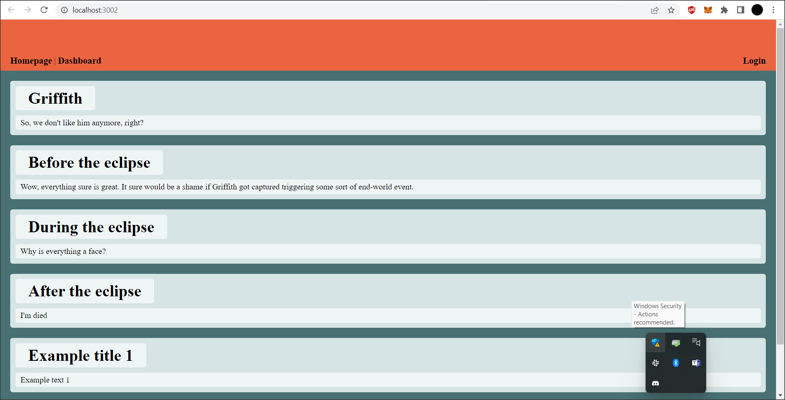

# blog-site

This MVC demonstration is a blog site that features the abilities to login and signup with the user data being stored in a database, as well as create and view posts that are saved as well. There is also password encryption using bcrypt.

 

 

Both the front end and back end code for this application was created from scratch; the dependencies incude: bcrypt, connect-session-sequelize, dotenv, express, express-handlebars, express-session, mysql2, and sequelize.